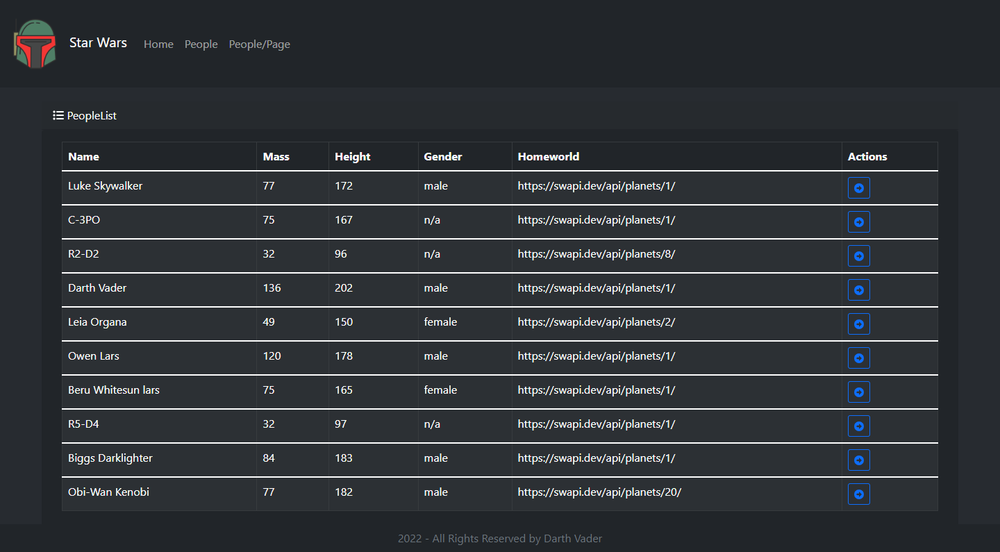

# Revenge of the Sith

This is a React Client Application designed to consume a GraphQL Star Wars API hosted on Hasura Cloud. The Application uses Apollo Client a comprehensive GraphQL library to fetch remote data and manage the data locally both through an internal cache as well as an entire state management API. The name of the application follows Star Wars Episode III - Revenge of the Sith, the best of them all.

## Setup Instructions

To set up the application locally you need both a backend and a frontend.

### Backend

Using Hasura, a number of actions have been defined. For example, to get all people:

The Action Defination is

type Query {
getPeople: People
}

The Type Configuration

type People {
results: Person!
}

type Person {
url: String!
name: String
mass: String
homeworld: String
height: String
gender: String
}

And the Webhook supplied:

https://swapi.dev/api/people/

### Frontend

ReactJS was used to build the user interface for the web application to handle the view layer.
ReactJS makes dynamic web pages and also allows for reusable components. To set the frontend of this application.
To run the application locally and after creating the GraphQL queries;

- npx-react-app supermatt-frontend
- npm install react-bootstrap bootstrap
- npm install --save react-router-dom
- npm i --save @fortawesome/fontawesome-svg-core
- npm install --save @fortawesome/free-solid-svg-icons
- npm install --save @fortawesome/react-fontawesome
- npm install axios

## BDD

### Hasura

Hasura Cloud is a fully managed, production ready GraphQL API as a service to aid in the development of faster modern applications. The platform assures performance, security & reliability requirements of the API.

Hasure also has a Launch Console called GraphiQL that provides a platform to fetch data with the help of queries. A query is a GraphQL Operation that allows you to retrieve specific data from the server. For example in our application:

query MyQuery {
getPeople {
results {
name
url
}
}
}

This query performs a POST request to GraphQL which in turn refers to the actions defined to perform a precise GET request of precisely the name and the URL requested in the Query. This is unlike making a GET directly to the API in that it filters the data to provide only the data required.

### GraphQL

## Future Modifications

**Note: this application used Hasura free subscription that limits the number of calls to `sixty`, in one day!**

One huge modification would be to find an open source alternative to Hasura. Initially the idea was run the GraphQL logic locally from a Java Spring Application ([Failed Attempt 1](https://github.com/deepeters/the-force-api), [Failed Attempt 2](https://github.com/deepeters/the-force-awakens)) but a future modification would be to build a working local backend.

## Technologies, Libraries and Frameworks Used

    - React Javascript
    - Hasura Cloud
    - Hasura GraphiQL Console
    - Apollo Client
    - Heroku Deploy

### LICENSE: [MIT LICENSE](https://raw.githubusercontent.com/deepeters/revenge-of-the-sith/master/LICENSE)
